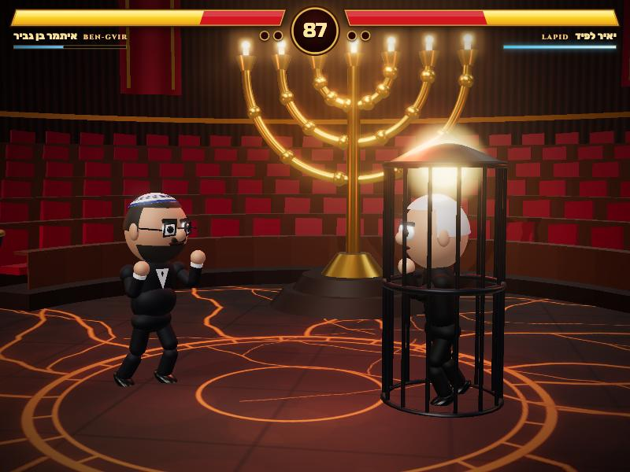
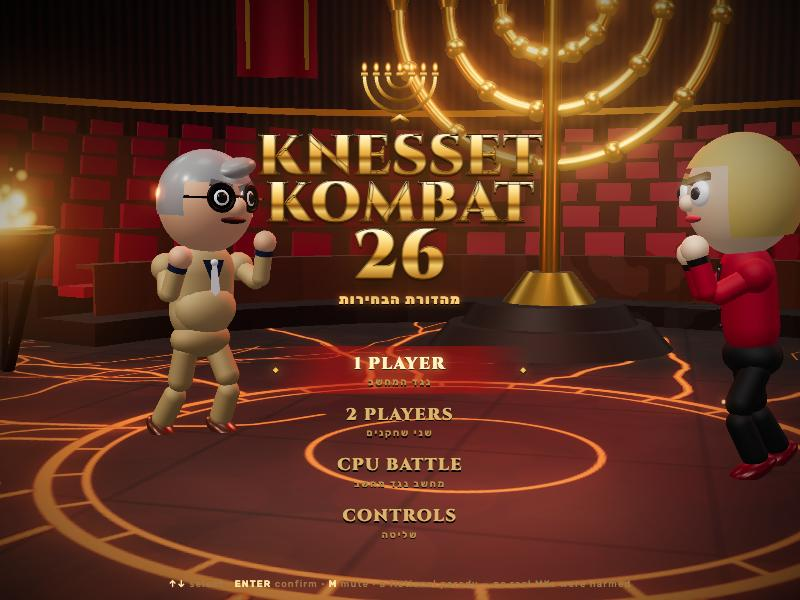
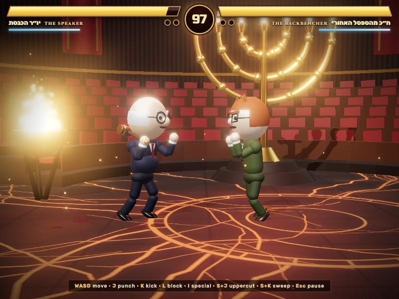
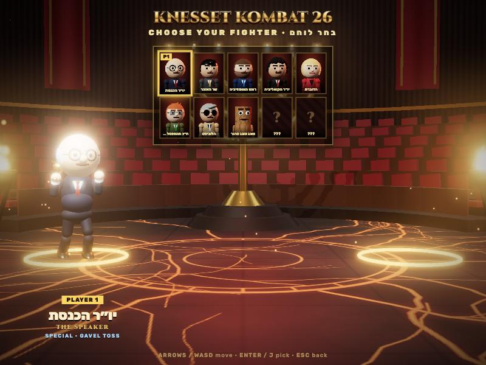
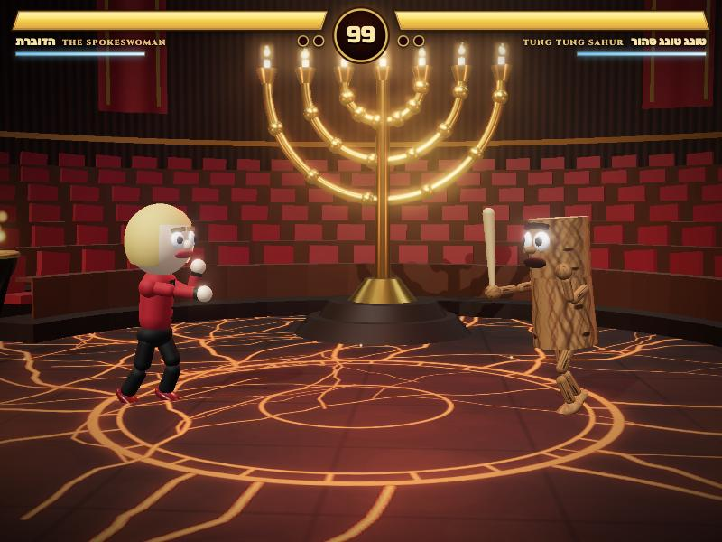
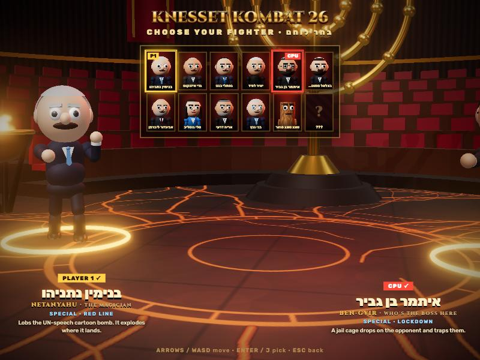

# Knesset Kombat 26 (Fan Remake)

A fan remake of the game by **[@kishkosh_1111](https://www.instagram.com/reel/Dd37xNRiz8x/)**. The original idea and game are theirs; this is Claude's recreation from their gameplay reel.

### ▶ [Play it in your browser](https://yarinbnyamin.github.io/knesset-kombat-26/)  ·  [Play the one-shot original](https://yarinbnyamin.github.io/knesset-kombat-26/original/)

A Mortal Kombat-style satirical fighting game in Three.js, set in a Knesset-style plenum, starring Israel's top politicians ahead of the October 2026 election.



## The experiment

This experiment gave **Claude Opus 5.5 (High)** a gameplay video from Instagram:
https://www.instagram.com/reel/Dd37xNRiz8x/

It took Claude **about 50 minutes** to recreate a playable, similar game, one-shot. It got no other instructions besides the link. (When Claude asked clarifying questions, the only answer was "it's one-shot, do your best".)

> **Only the first commit is the one-shot:** [`c14e669`](https://github.com/yarinbnyamin/knesset-kombat-26/tree/c14e669486c661c5d229f2e9b2154642d85fb4b6). You can still play that exact version at [/original](https://yarinbnyamin.github.io/knesset-kombat-26/original/). Everything after it (the real roster, the new abilities, CPU difficulty) came from follow-up prompts.

What Claude did in those ~50 minutes (16:13 → 17:03):

- Opened the reel in a browser. Instagram needed a login, so it pulled 18 frames straight out of the video element (no audio) and studied them.
- Designed and wrote the whole game from scratch: no assets, no build step, about 2,500 lines of JavaScript.
- Play-tested it in the browser (a full CPU-vs-CPU match, every special, the menus) and fixed what it found.

Everything is procedural: the character models, animation, arena, textures, particles, music, sound effects and announcer (browser speech synthesis).

The one-shot version had fictional caricatures:

| | |
|---|---|
|  |  |
|  |  |

### After the one-shot: the real roster

In later commits, follow-up prompts asked Claude to use Israel's top 10 politicians, drawn in the same cartoon style, and to research each one online to design their special move. Claude researched their public personas and built a new mechanic for each ability (lobbed bombs, traps, grabs, counters, buffs, teleports).



## Features

- Gavel-slam intro, title screen, character select, VS screen, best-of-3 rounds, FINISH HIM, fatality, results.
- **11 fighters:** 10 politicians as big-head cartoon caricatures (hair, beards, glasses, knitted and velvet kippot), plus Tung Tung Sahur.
- **Parliamentary Fatality:** a giant gavel flattens the loser.
- **Modes:** 1 player vs CPU, 2 players on one keyboard, CPU vs CPU. Gamepads are supported.
- **CPU difficulty:** Easy, Normal, Hard or Knesset Veteran, set on the title screen (←/→ on the CPU item). Your choice is remembered.

## Roster

Each special move is built on the person's public persona, slogans or famous moments.

| Fighter | Special | Based on | What it does |
|---|---|---|---|
| Benjamin Netanyahu | RED LINE | The cartoon bomb from his 2012 UN speech | Lobs a bomb that lands on the opponent and explodes |
| Gadi Eisenkot | YASHAR! CHARGE | His party Yashar ("straight") | A straight charge that can't be interrupted |
| Naftali Bennett | UNDERCOVER HIPSTER | His 2015 disguise campaign ad | Vanishes, reappears behind you and strikes |
| Yair Lapid | WHERE'S THE MONEY? | His slogan; he's also an amateur boxer | Grab that steals health |
| Itamar Ben-Gvir | LOCKDOWN | His tough-on-prisons persona | A jail cage drops on the opponent and traps them |
| Bezalel Smotrich | BUDGET CUT | Finance Minister | Scissors that cut the opponent's special meter to zero |
| Avigdor Lieberman | NOT ON THE LIST | He worked as a nightclub bouncer | Grab and throw across the stage |
| Tally Gotliv | OBJECTION! | Her Knesset committee shouting matches | A slow sonic scream that stuns |
| Arye Deri | RESTORE PAST GLORY | The Shas slogan and his comebacks | Heals and hits harder for 5 seconds |
| Benny Gantz | WAIT YOUR TURN | The rotation deal that never came | Counter stance that reverses any melee hit |
| Tung Tung Sahur | TUNG TUNG DASH | The meme | Charges in swinging the bat |

This is political satire, made for fun and not for profit. It is not affiliated with the Knesset, any party or any politician. Specials are based on public personas and slogans, not on legal cases or personal lives.

## Controls

| | Player 1 | Player 2 | Gamepad |
|---|---|---|---|
| Move / jump / crouch | W A S D | Arrows | D-pad / stick |
| Punch | J | , or Num1 | □ / X |
| Kick | K | . or Num2 | ✕ / A |
| Block | L | / or Num3 | ○ / B, bumpers, triggers |
| Special | I or U | ; or Num5 | △ / Y |
| Pause | Esc or P | | Options |

- Down + Punch: uppercut (launcher)
- Down + Kick: sweep (low)
- Forward + Kick: roundhouse
- Punch or Kick while jumping: overhead attack
- Stand to block high, crouch to block low.
- At FINISH HIM, press Special for the Parliamentary Fatality.
- M: mute

Keyboard or gamepad only for now. There are no touch controls.

## Run locally

ES modules need a local server (no build step, no Node):

```bash
python3 -m http.server 8026
```

Then open http://localhost:8026.

## Files

- `src/roster.js`: the fighters (looks, stats, specials)
- `src/textures.js`: knitted and velvet kippah textures
- `original/`: the one-shot version from the first commit, unmodified
- `tools/faceview.html`: close-up of every fighter's head, for tuning looks
- `tools/serve.py`: local dev server with caching turned off
- `src/fighter.js`: state machine, move frame data, hitboxes
- `src/poses.js`: procedural animation poses
- `src/model.js`: procedural character models, portraits
- `src/stage.js`: the arena, lighting, fire
- `src/projectiles.js`: special-move objects (bomb, cage, scissors, scream)
- `src/ai.js`, `src/audio.js` (all synthesized), `src/input.js`, `src/ui.js`
- `src/main.js`: game flow (title → select → versus → rounds → finish → results)

Console helper: `__dbg.fight(0, 7, 'cpu')` jumps straight into a match.
